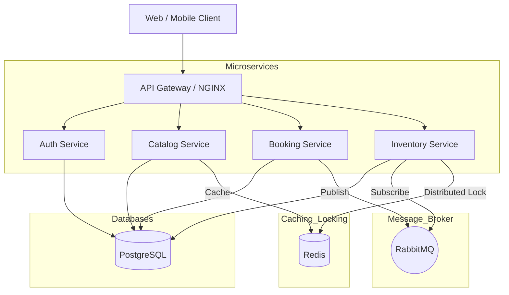
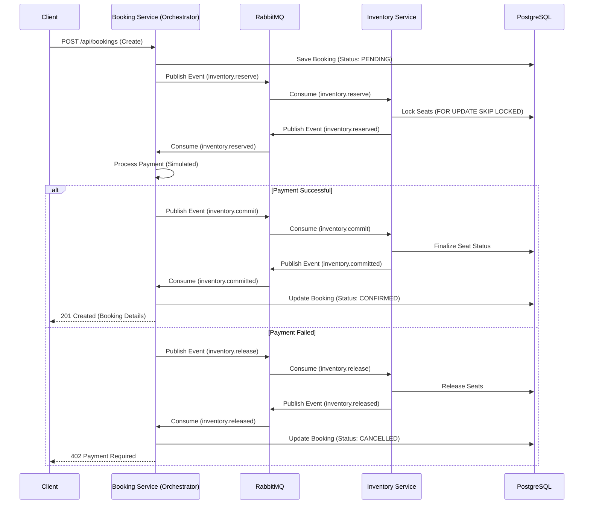
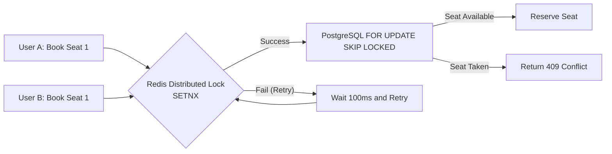

# Architecture & Design Document
## Ticket Booking System

This document outlines the architectural design of the Ticket Booking System, which leverages a Microservices architecture to ensure high availability, scalability, and robust fault tolerance.

### 1. High-Level Architecture

The system is composed of several independent microservices communicating via an API Gateway and asynchronous message brokers. 

### 2. The Saga Pattern (Distributed Transactions)

To ensure data consistency across multiple services without distributed locks blocking the entire system, we use the Saga Orchestration Pattern for the checkout and booking flow.

### 3. Concurrency & Inventory Locking

Handling hundreds of users attempting to book the exact same seat requires a robust locking strategy to prevent overselling while maintaining performance.

